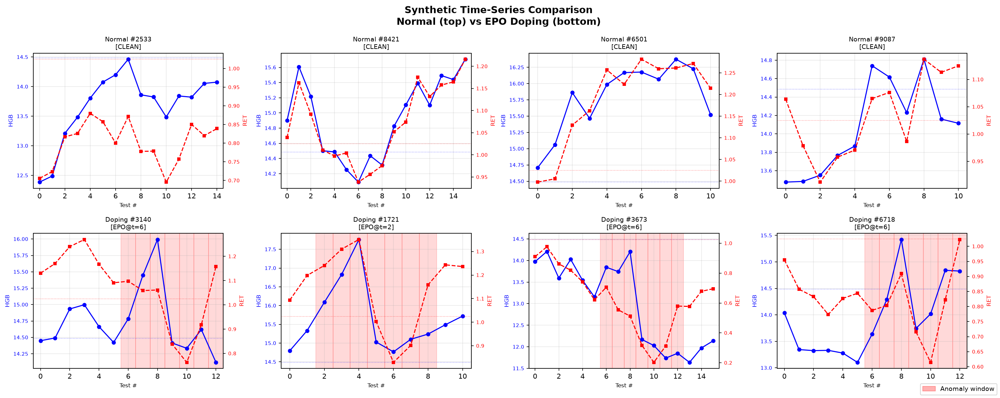
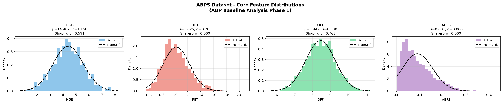
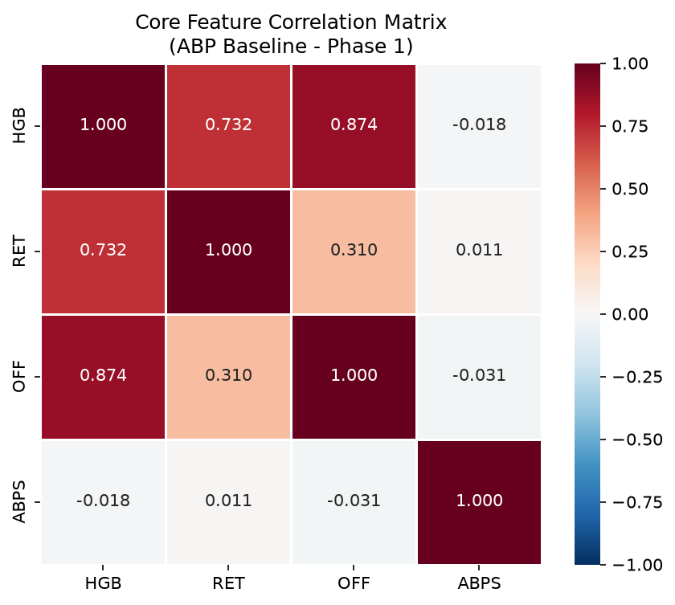

# abp-synth

> **Synthetic Athlete Biological Passport (ABP) time-series generator for anti-doping research.**

[](https://python.org)
[](LICENSE)

---

## Overview

**abp-synth** generates realistic synthetic longitudinal blood profiles (Hemoglobin & Reticulocyte) for anti-doping research. It extracts statistical baselines from the real-world [ABPS](https://cran.r-project.org/package=ABPS) dataset and synthesises time-series with optional EPO doping pattern injection.

### Why?

Real athlete blood passport data is virtually impossible to obtain due to GDPR, athlete privacy, and extreme label scarcity. **abp-synth** solves this by providing:

- **Physiologically grounded baselines** derived from Sottas et al. (2008) and the ABPS R package
- **Temporally correlated sequences** via mean-reverting multivariate random walks (AR(1))
- **Realistic EPO doping signatures** with configurable two-phase HGB rise / RET drop injection
- **Publication-quality visualisations** out of the box

| Normal Athlete Profiles | EPO Doping Profiles |
| :---: | :---: |
|  | *(Red shading = anomaly window)* |

---

## Installation

```bash
pip install -e .
```

Or with remote `.rda` loading support:

```bash
pip install -e ".[remote]"
```

## Quick Start

### Python API (5 lines)

```python
from abp_synth import generate_dataset

dataset = generate_dataset(n_normal=1000, n_doping=100, seed=42)
print(dataset.summary())
dataset.save("./output")
df = dataset.to_dataframe()
```

### Command Line

```bash
# Generate full dataset
abp-synth generate --n-normal 10000 --n-doping 1000 --output ./output

# Extract baseline only
abp-synth baseline --output ./output

# Create all visualizations
abp-synth visualize --input ./output --output ./figures
```

---

## Core Concepts

### Baseline Extraction

Statistics are extracted from the ABPS dataset (bundled as CSV):

| Parameter | Symbol | Description |
|---|---|---|
| **Hemoglobin** | HGB (g/dL) | Oxygen-carrying capacity; rises with EPO |
| **Reticulocyte %** | RET (%) | Immature RBC fraction; drops after EPO withdrawal |
| **OFF Score** | HGB − 60√RET | WADA composite marker |
| **ABPS Score** | ABPS | Bayesian violation probability |




### Synthetic Time-Series Generation

Clean athlete profiles are generated via a mean-reverting random walk:

$$\mathbf{x}_t = \mathbf{x}_{t-1} + \boldsymbol{\epsilon}_t + \alpha(\boldsymbol{\mu} - \mathbf{x}_{t-1})$$

where $\boldsymbol{\epsilon}_t \sim \mathcal{N}(\mathbf{0},\, \sigma^2 \boldsymbol{\Sigma})$ and $\alpha = 0.05$.

### EPO Doping Injection

Two-phase physiological response:

- **Phase A (Injection)**: HGB linear ramp-up (+1.5 to +3.0 g/dL)
- **Phase B (Withdrawal)**: RET sinusoidal suppression (−0.25% to −0.50%)

---

## API Reference

### `load_abps_data(source="bundled")`

Load the ABPS baseline dataset. `source` can be `"bundled"`, `"remote"`, or a CSV file path.

### `extract_baseline(df, features=None)`

Extract mean vector, covariance and correlation matrices. Returns a `BaselineResult`.

### `generate_dataset(n_normal, n_doping, ...)`

One-call generation of a complete `SyntheticDataset` with clean + doped profiles.

### `SyntheticDataset`

- `.save(path)` / `.load(path)` — NumPy serialization
- `.to_dataframe()` — Long-format pandas DataFrame
- `.summary()` — Human-readable statistics

---

## Project Structure

```
abp-synth/
├── src/abp_synth/
│   ├── baseline.py       # Data loading & statistics
│   ├── synthesizer.py    # Time-series generation
│   ├── visualization.py  # Plotting functions
│   ├── cli.py            # Click CLI
│   └── data/             # Bundled ABPS CSV
├── tests/                # pytest test suite
├── examples/             # Usage examples
└── docs/images/          # README figures
```

## Development

```bash
pip install -e ".[dev]"
pytest tests/ -v
```

## References

1. Sottas, P.E. et al. (2008). *Biostatistics*, 9(2), 285-296.
2. Sharpe, K. et al. (2006). *Haematologica*, 91(12), 1603-1610.
3. WADA (2019). *ABP Operating Guidelines*.

## License

MIT — see [LICENSE](LICENSE).
